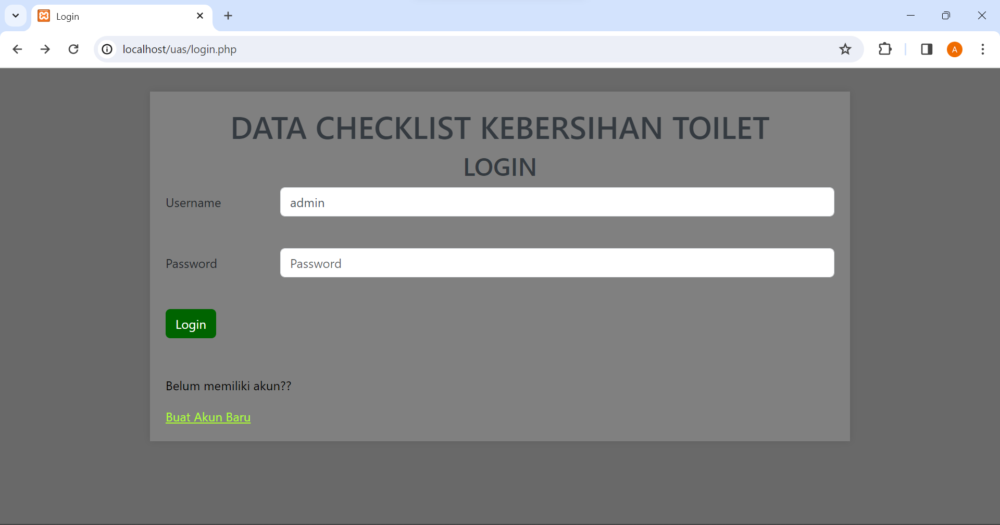
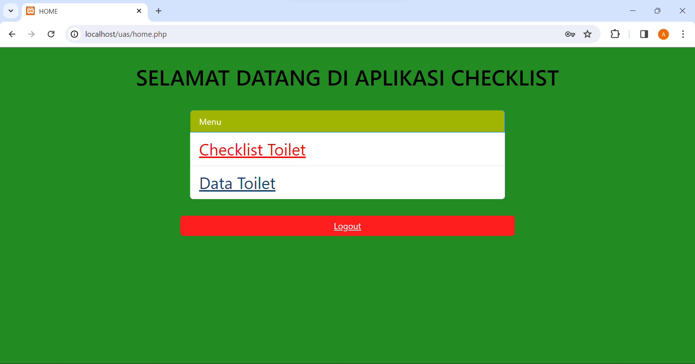

# UAS_Sistem_Checklist_Kebersihan_Toilet

# Project Tugas Kelompok { UAS }

|**Nama**|**NIM**|**Kelas**|**Matkul**|
|----|---|-----|------|
|Afrizal Fajrianto Anggara Sakti|312210449|TI.22.A.4|Pemograman Web 1|
|Ahmad Yuda Ramadhan |312210650|TI.22.A.4|Pemograman Web 1|
|Dhefi Nur Kholik|312210107|TI.22.A.4|Pemograman Web 1|

[Link Dokumentasi YouTube](https://youtu.be/GyDch9eYWgE)

***( turn off windows security )***

## Tampilan Pada Halaman Website

***Tampilan Login :***

***Tampilan Menu :***

***Tampilan Checklist Toilet :*** 

***Tampilan Tambah Data :*** 

***Tampilan Ubah Data :*** 

***Tampilan List Data Toilet :*** 

***Tampilan Tambah Data Toilet :*** 

## Manfaat dari Project ini :

Membuat sistem checklist kebersihan toilet dengan PHP dan MySQL dapat memberikan beberapa manfaat bagi pengelolaan kebersihan toilet di suatu tempat. beberapa manfaat seperti : Pemantauan Kebersihan , Penjadwalan Pembersihan , Tindak Lanjut Perbaikan serta Dokumentasi dan Pelaporan.

Membuat sistem checklist kebersihan toilet dengan PHP dan MySQL memungkinkan pengelolaan kebersihan yang lebih terorganisir, efisien, dan efektif, yang pada gilirannya dapat meningkatkan kualitas lingkungan dan pelayanan.

SELESAI.